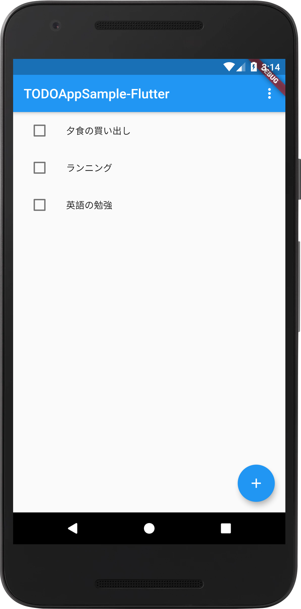
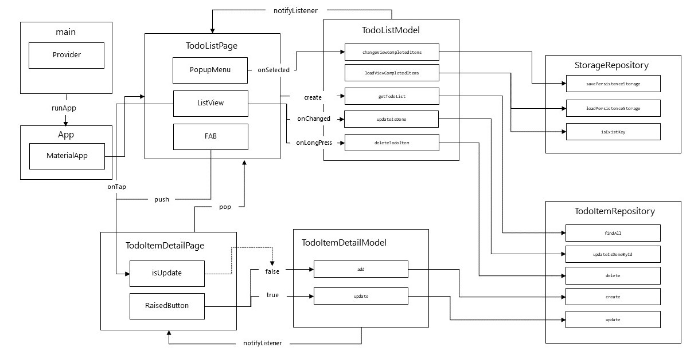

# TODOAppSample-Flutter

A sample Todo App with Provider  
This project uses Git-Flow  

## version
1.3.1

## DEMO



## Diagram
  

## Testing
To test on MacOS, execute the following command
```
flutter test --coverage
genhtml coverage/lcov.info -o coverage/html
```

## Libraries
 - provider: ^4.3.2+2
 - sqflite: ^1.3.2+1
 - shared_preferences: ^0.5.12+4
 
## License
Copyright (c) 2020 tokku5552  
This software is released under the MIT License.  
https://opensource.org/licenses/mit-license.php
