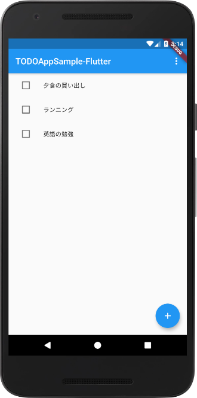
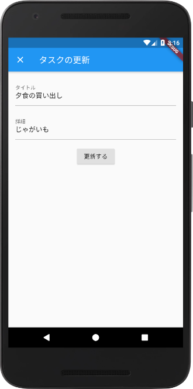

# todo_app_sample_flutter

A sample Todo App with Provider

## DEMO

## Libraries
 - provider: ^4.3.2+2
 - sqflite: ^1.3.2+1
 - shared_preferences: ^0.5.12+4
 
## License
Copyright (c) 2020 tokku5552
This software is released under the MIT License.
https://opensource.org/licenses/mit-license.php